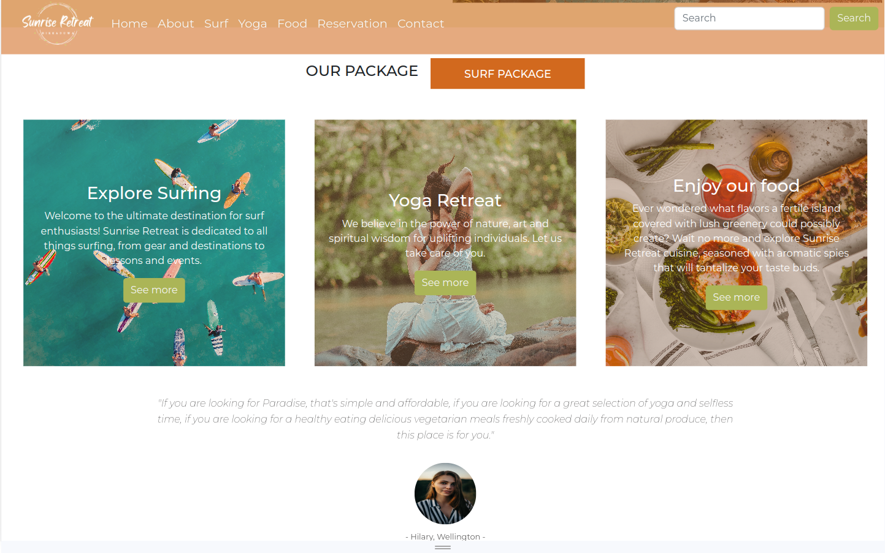

## Overview 
This group project showcases our skills in CSS/SASS/Bootstrap. Beyond improving our technical skills, it has provided a platform for us to work cohesively as a team, refine our soft skills, and seamlessly collaborate using GitHub. 
We decided to create a website for a beautiful retreat place in Sri Lanka, inspired by our shared love for nature and stunning images of the country.  

## Features
- Dynamic text animation
- Specific styles for sections like .booking, .banner, .our-package, and .services.
- Service sections feature background images with gradient overlays.
- Image with a subtle scaling and translational animation (@keyframes).
- Media queries ensure responsiveness for diverse screen sizes, providing an optimal viewing experience.
- Carousel styling includes indicators, captions, and responsive adjustments for a seamless user experience.

These CSS features collaboratively contribute to a visually appealing, responsive, and user-friendly design for the Sunrise Retreat website.

## Technologies Used
- [Parcel](https://parceljs.org/)
- [Sass](https://sass-lang.com/)
- [Bootstrap](https://getbootstrap.com/)


## Demo

[Live Demo](https://statuja.github.io/sunriseRetreat_website/)



## Useful commands

#### Clone the repository
```
git clone [https://github.com/your-username/Villa-design.git](https://github.com/statuja/sunriseRetreat_website.git)
```
#### Navigate to the project folder
```
cd sunriseRetreat_website
```
#### Install dependencies
```
npm install
```
#### Production
Compile source code from **src** and create an optimized production bundle in **dist** folder ready for **deployment**.
```
npm run build
```
#### Deploy to Github Pages
Deploy your code to **Github Pages**: this script creates a 'gh-pages' branch and publishes the **dist** folder. For this to work, make sure you already have a remote repository on github.
```
npm run publish
```

### Project Structure
```
Project
│   README.md
│   package.json
|   package-lock.json
└───src
│   │   index.html
│   |   sassy-css.scss
|   └───images
└───dist
```


